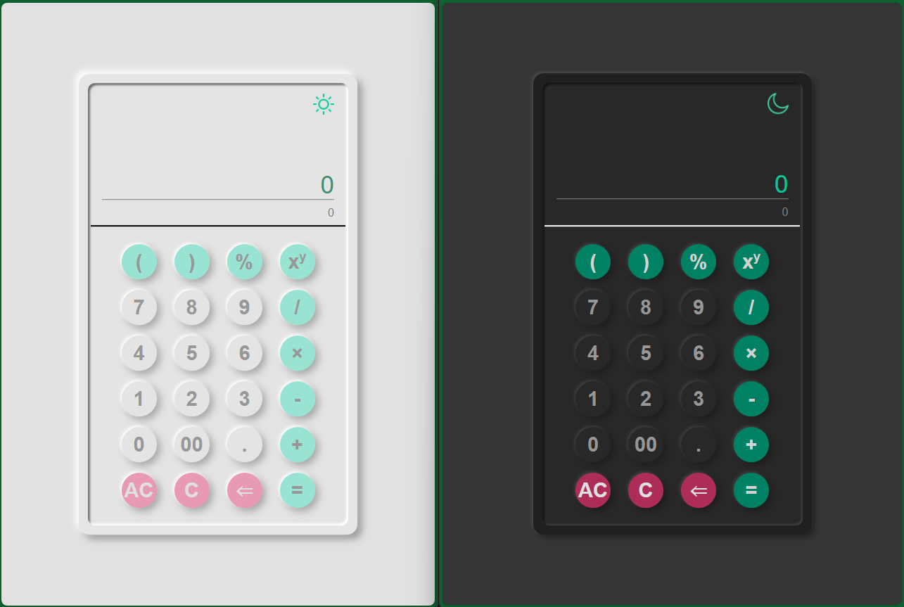

# Calculator

This is a simple web calculator application built using vanilla HTML, CSS, and JavaScript. It provides basic arithmetic operations along with additional functionalities like percentage, exponentiation, and the ability to switch between light and dark themes.

## Features

- Arithmetic operations: Addition (+), Subtraction (-), Multiplication (*), Division (/);
- Additional operations: Exponentiation (^), Percentage (%);
- Functionality to clear the input (C), clear the input and the history (AC), and remove the last entered character (<=);
- Switch between light and dark themes;
- Responsive design for seamless usage across different devices.

## Usage

1. Clone the repository to your local machine.

2. Open the project directory.

3. Open src folder.

4. Open `index.html` in your preferred web browser.

5. Start performing calculations using the provided buttons.

## License

[MIT License](LICENSE)

## Screenshots

